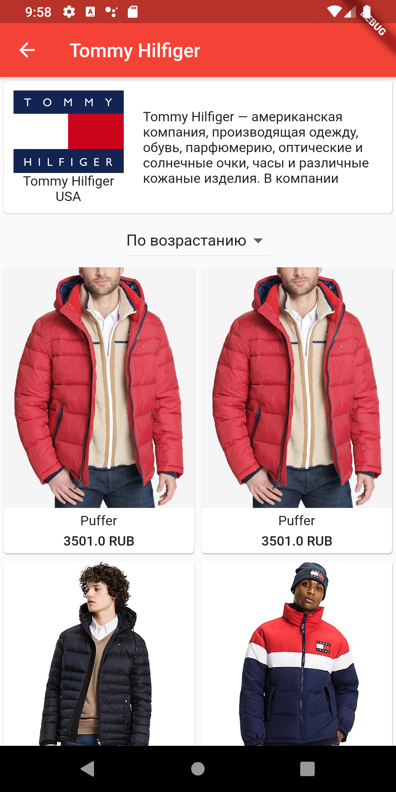

# Market diploma

Кроссплатформенное приложение Магазин на Flutter на диплом.

## День 2
Fake datasources, repositories, mappers, models, entities, products page, test usecase and bloc

## День 5
home (bloc, screen), category (bloc, screen)

## День 6
detail product page, bloc

## День 7
manufacture products list, products_list widget, description property to manufacture

